# Mini TaskHub

A premium, production-grade to-do list application built with Flutter. Designed with a sleek, modern aesthetic using **DM Serif Display** for elegant headings and **Inter** for highly readable body text. Mini TaskHub features robust state management, secure backend authentication, and a stunning UI that seamlessly adapts to both Light and Dark modes.

---

## 📸 App Showcase

|   |   |   |   |
|:---:|:---:|:---:|:---:|
| 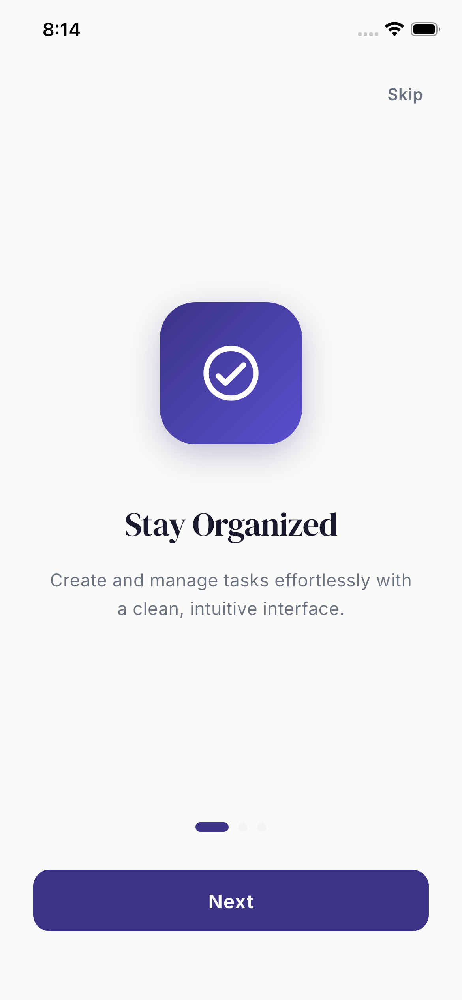<br>*Splash/Onboarding* | 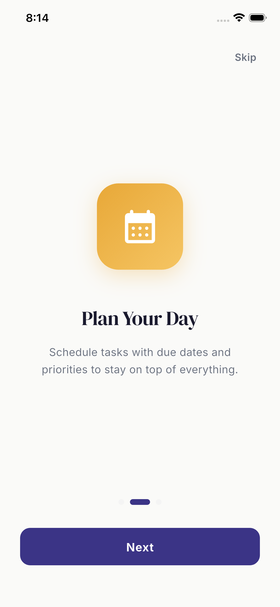<br>*Login Screen* | 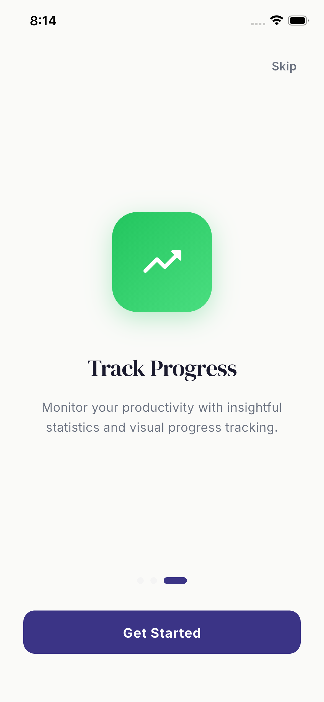<br>*Signup Screen* | 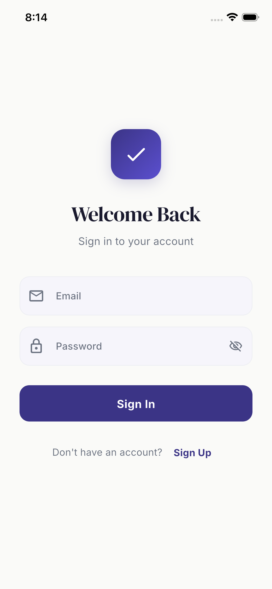<br>*Dashboard Overview* |
| 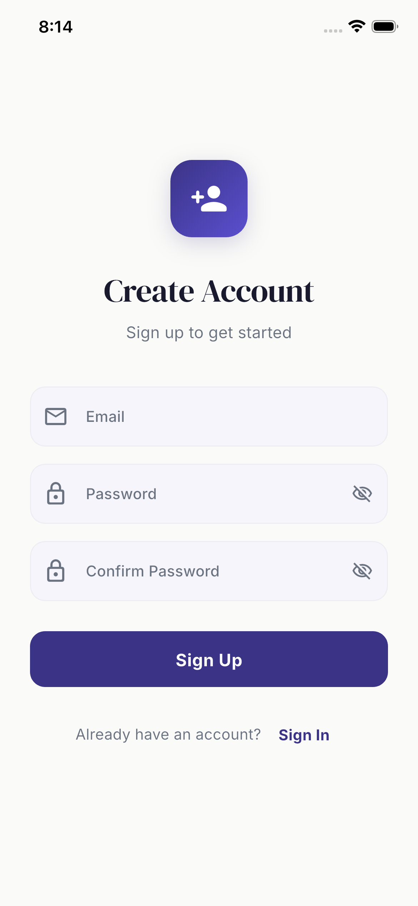<br>*Task Details* | 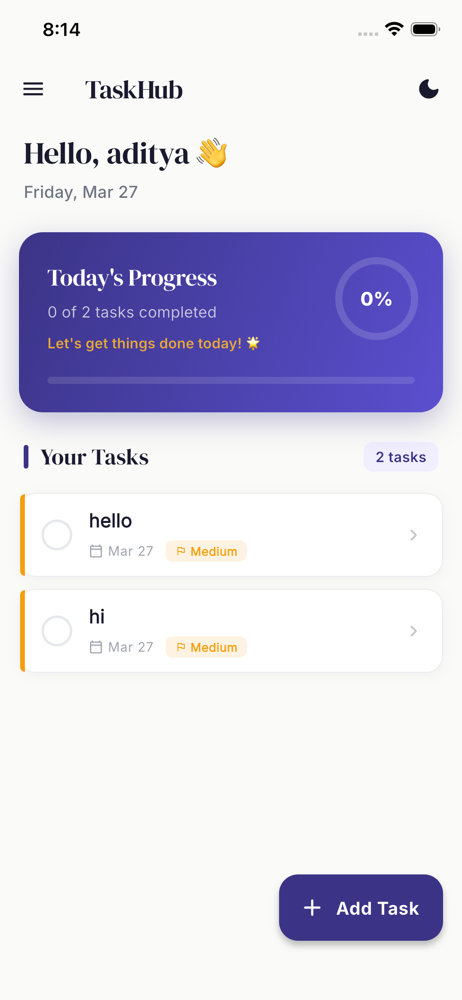<br>*Add New Task* | 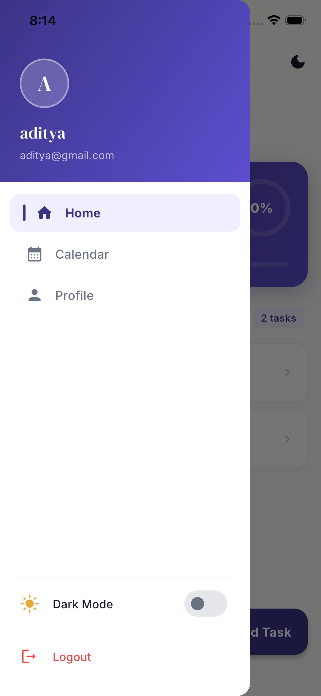<br>*Calendar View* | 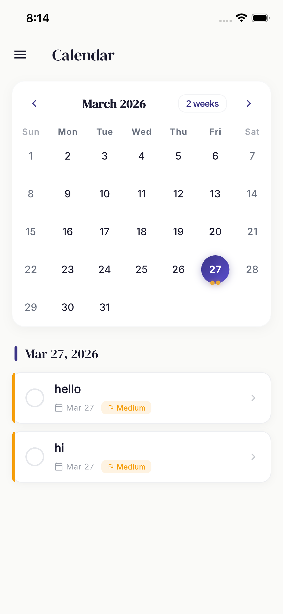<br>*Profile & Stats* |
| 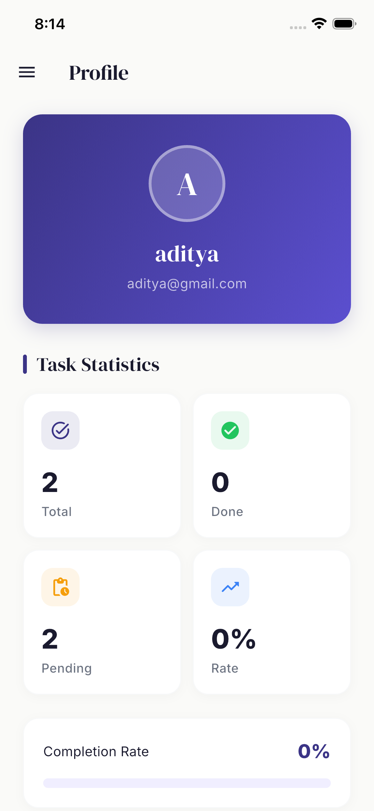<br>*Dark Mode Home* | 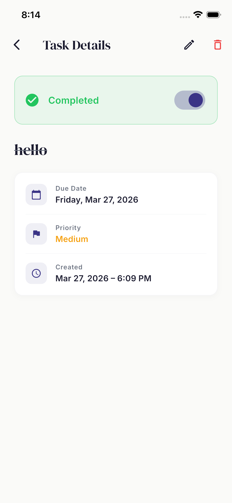<br>*Dark Mode Details* | 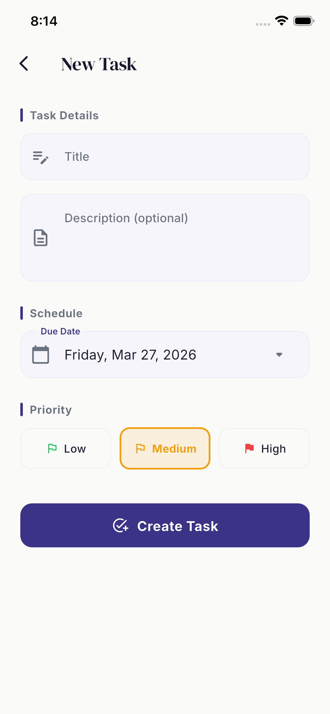<br>*Dark Mode Calendar* | 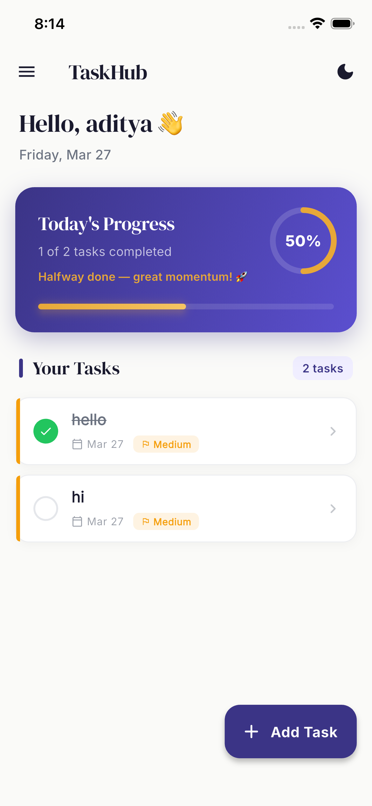<br>*Dark Mode Profile* |

---

## ✨ Features

*   **Premium Aesthetic:** A cohesive design system providing a high-end feel inspired by top-tier productivity apps (e.g., Things 3, Todoist).
*   **Dual Themes:** Full support for both beautiful Light modes (Deep Indigo & Warm Amber) and sophisticated Dark modes (Near-black Navy, Soft Lavender & Warm Gold).
*   **Authentication:** Secure email and password authentication powered by Supabase.
*   **State Management:** Reactive and lightweight state management using **Riverpod**.
*   **Routing:** Fluid navigation and deep-linking capabilities using **GoRouter**.
*   **Task Management:**
    *   Create, view, update, and delete tasks.
    *   Assign priorities (Low, Medium, High) with corresponding visual indicators.
    *   Set due dates.
    *   Mark tasks as pending or completed with smooth animations.
*   **Calendar View:** A dedicated, interactive calendar screen to visualize and manage tasks by date.
*   **Interactive Dashboard & Profile:** Track progress through automated statistical summaries and progress rings.
*   **Onboarding:** A sleek, engaging onboarding flow for first-time users.

---

## 🛠 Tech Stack

*   **Framework:** [Flutter](https://flutter.dev/)
*   **Backend as a Service (BaaS):** [Supabase](https://supabase.com/) (Authentication & Database)
*   **State Management:** `flutter_riverpod`
*   **Routing:** `go_router`
*   **Typography:** `google_fonts` (DM Serif Display, Inter)
*   **Date Formatting:** `intl`
*   **Calendar:** `table_calendar`

---

## 🚀 Getting Started

### Prerequisites
*   Flutter SDK (See [Install Flutter](https://docs.flutter.dev/get-started/install))
*   A Supabase account and project.

### 1. Clone the repository
```bash
git clone https://github.com/your-username/mini-taskhub.git
cd mini-taskhub
```

### 2. Install dependencies
```bash
flutter pub get
```

### 3. Setup Supabase Configuration
Create an `.env` file in the root directory (if you are using `flutter_dotenv`) or directly update your Supabase initialization in `main.dart`:

```dart
// In lib/main.dart
await Supabase.initialize(
  url: 'YOUR_SUPABASE_PROJECT_URL',
  anonKey: 'YOUR_SUPABASE_ANON_KEY',
);
```
*(Ensure your Supabase project has Authentication enabled and the required Postgres tables created according to the `TaskModel`.)*

### 4. Run the app
```bash
flutter run
```

---

## 📂 Project Structure

The project follows a feature-first architecture to ensure scalability and maintainability:

```
lib/
├── core/
│   ├── models/           # Shared models (e.g., TaskModel)
│   ├── theme/            # AppTheme class containing Light & Dark mode palettes
│   └── router/           # GoRouter configuration
├── features/
│   ├── auth/             # Login, Signup, and Splash screens
│   ├── calendar/         # Calendar view screen
│   ├── onboarding/       # Onboarding flow
│   ├── profile/          # Profile and statistics screen
│   └── tasks/            # Home, Add Task, Task Details, and Task Services
├── shared/
│   └── widgets/          # Reusable UI components (Custom Buttons, TextFields, Tiles)
└── main.dart             # Application entry point
```

---

## 🎨 Theme & Typography

The application strictly adheres to the definitions in `AppTheme` (`lib/core/theme/app_theme.dart`). 

*   **Primary Headings**: `DM Serif Display`
*   **Body & UI Elements**: `Inter`

To modify colors or component shapes (like Cards, Buttons, or Inputs), update the respective `ThemeData` properties in `AppTheme`. The entire app will adapt automatically to variations in Light or Dark modes.

---

## 📄 License

This project is licensed under the MIT License - see the [LICENSE](LICENSE) file for details.
